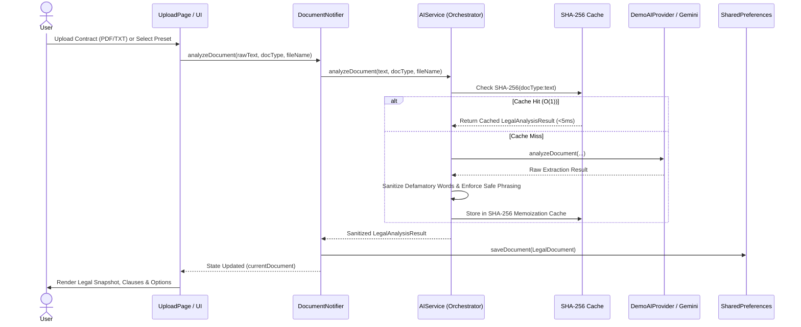

# LegalLens AI — System & Software Architecture

LegalLens AI is engineered according to **Clean Architecture** and **Domain-Driven Design (DDD)** principles, guaranteeing strict separation of concerns, complete decoupling of presentation from AI engines, and 100% client-side privacy.

---

## 🏛️ Clean Architecture Layering

```
                     ┌────────────────────────────────────────────────────────┐
                     │                  Presentation Layer                    │
                     │  • Pages (Snapshot, Clauses, Obligations, Options, QA) │
                     │  • Widgets (GlassCard, PriorityBadge, Shell)          │
                     │  • Riverpod StateNotifiers (DocumentAnalysisState)     │
                     └───────────────────────────┬────────────────────────────┘
                                                 │ (Depends only on Domain)
                                                 ▼
                     ┌────────────────────────────────────────────────────────┐
                     │                     Domain Layer                       │
                     │  • Entities (LegalDocument, LegalClause, LegalOption)  │
                     │  • Enums (AttentionTier, DocumentComplexity)          │
                     │  • Repository Interfaces (IDocumentRepository)         │
                     └───────────────────────────▲────────────────────────────┘
                                                 │ (Implemented by Data & Services)
                     ┌───────────────────────────┴────────────────────────────┐
                     │                 Data & Services Layer                  │
                     │  • Repositories (DocumentRepositoryImpl)               │
                     │  • Services (AIService, DocumentParserService)         │
                     │  • AI Providers (DemoAIProvider, GeminiAIProvider)     │
                     │  • Storage (LocalStorageService via SharedPreferences) │
                     └────────────────────────────────────────────────────────┘
```

### Layer Responsibilities

1. **Domain Layer (`lib/domain/`):**
   - Pure Dart code with zero external framework dependencies.
   - Defines core legal entities (`LegalDocument`, `LegalClause`, `Obligation`, `ImportantDate`, `RiskItem`, `LegalOption`, `NextStep`, `LawyerQuestion`, `ChecklistItem`).
   - Declares repository interfaces (`IDocumentRepository`, `IChecklistRepository`, `ISettingsRepository`).

2. **Data Layer (`lib/data/`):**
   - Implements domain repository interfaces using local browser storage (`shared_preferences`).
   - Serializes and deserializes JSON models with schema integrity.

3. **Services Layer (`lib/services/`):**
   - `DocumentParserService`: Extracts text from `.txt`, `.md`, and `.pdf` files, segments text into numbered sections and clauses.
   - `AIService`: Orchestrator and safeguard validation layer. Handles SHA-256 analysis caching, defamatory word scrubbing, and provider routing.
   - `AIProvider`: Common interface implemented by `DemoAIProvider` (deterministic local NLP) and `GeminiAIProvider` (optional real GenAI).
   - `ExportService`: Generates structured Markdown and JSON bundles.

4. **Presentation Layer (`lib/presentation/`):**
   - Modern Material 3 UI with dark/light theme support.
   - Riverpod state management (`flutter_riverpod`) providing reactive, predictable state transitions.
   - GoRouter declarative routing with responsive desktop sidebar and mobile navigation drawer.

---

## 🔄 End-to-End Document Intelligence Flow



---

## 🧩 State Management Lifecycle (Riverpod 2.6)

- **`documentNotifierProvider` (`StateNotifierProvider<DocumentNotifier, DocumentAnalysisState>`):**
  - Holds `currentDocument`, `isAnalyzing`, `progressStage`, and `errorMessage`.
  - Immutable state updates via `copyWith`.
- **`themeModeProvider` (`StateNotifierProvider<ThemeModeNotifier, ThemeMode>`):**
  - Manages Dark vs Light theme with automatic persistence to browser storage.
- **`settingsNotifierProvider` (`StateNotifierProvider<SettingsNotifier, SettingsState>`):**
  - Controls Demo Mode vs Real GenAI mode and secure in-memory storage of API keys.
- **`qaNotifierProvider` (`StateNotifierProvider<QANotifier, QAState>`):**
  - Manages grounded document conversational history, query citations, and strict refusal states.

---

## 🔒 Inversion of Control & Testability

Every service and repository is injected via Riverpod providers (`ref.watch(documentRepositoryProvider)`), enabling 100% testability. Unit and widget tests can override any provider with mock implementations without touching production code.
