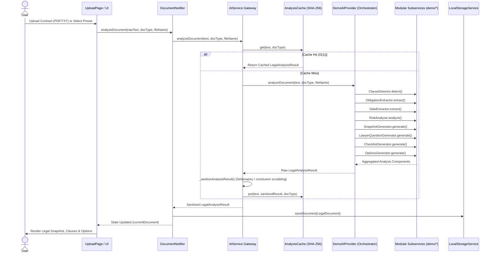

# LegalLens AI — System & Software Architecture

LegalLens AI is engineered according to **Clean Architecture** and **Domain-Driven Design (DDD)** principles, guaranteeing strict separation of concerns, complete decoupling of presentation from AI engines, and 100% client-side privacy.

---

## 🏛️ Clean Architecture Layering

```
                     ┌────────────────────────────────────────────────────────┐
                     │                  Presentation Layer                    │
                     │  • Pages (Snapshot, Clauses, Obligations, Options, QA) │
                     │  • Widgets (GlassCard, PriorityBadge, Shell)          │
                     │  • Riverpod StateNotifiers (DocumentAnalysisState)     │
                     └───────────────────────────┬────────────────────────────┘
                                                 │ (Depends only on Domain)
                                                 ▼
                     ┌────────────────────────────────────────────────────────┐
                     │                     Domain Layer                       │
                     │  • Entities (LegalDocument, LegalClause, LegalOption)  │
                     │  • Enums (AttentionTier, DocumentComplexity, Risk)     │
                     │  • Repository Interfaces (IDocumentRepository)         │
                     └───────────────────────────▲────────────────────────────┘
                                                 │ (Implemented by Data & Services)
                     ┌───────────────────────────┴────────────────────────────┐
                     │                 Data & Services Layer                  │
                     │  • Repositories (DocumentRepositoryImpl)               │
                     │  • Services (AIService, DocumentParserService)         │
                     │  • Caching (AnalysisCache via Content SHA-256)        │
                     │  • AI Orchestrator (DemoAIProvider & GeminiAIProvider) │
                     │  • Modular Intelligence (lib/services/ai/demo/*)       │
                     │  • Storage (LocalStorageService with Cleanup Cascade)  │
                     └────────────────────────────────────────────────────────┘
```

### Layer Responsibilities

1. **Domain Layer (`lib/domain/`):**
   - Pure Dart code with zero external framework dependencies.
   - Defines core legal entities (`LegalDocument`, `LegalClause`, `Obligation`, `ImportantDate`, `RiskItem`, `LegalOption`, `NextStep`, `LawyerQuestion`, `ChecklistItem`, `ClauseDiff`, `DocumentComparison`).
   - Declares repository interfaces (`IDocumentRepository`, `IChecklistRepository`, `ISettingsRepository`).

2. **Data Layer (`lib/data/`):**
   - Implements domain repository interfaces using local browser storage (`shared_preferences`).
   - Handles serialization, deserialization, and defensive fallback against malformed stored entries.

3. **Services Layer (`lib/services/`):**
   - `DocumentParserService`: Extracts text from `.txt`, `.md`, and `.pdf` files, segments text into numbered sections and headers.
   - `AnalysisCache`: Dedicated content-addressed in-memory cache keyed by deterministic SHA-256 hashes of normalized document text, providing $O(1)$ lookups and diagnostic metrics (`hits`, `misses`, `hitRate`).
   - `AIService`: Application gateway coordinating active providers, cache resolution, and post-analysis safety sanitization.
   - `DemoAIProvider`: Orchestration layer coordinating 10 specialized intelligence subcomponents under `lib/services/ai/demo/`.
   - `GeminiAIProvider`: Cloud-assisted intelligence option using Google Gemini 1.5 Flash.
   - `ExportService`: Generates structured Markdown and JSON reports across all deliverables.

4. **Modular Demo AI Subcomponents (`lib/services/ai/demo/`):**
   - `ClauseDetector`: Declarative `ClauseRule` registry covering 15 legal categories.
   - `ObligationExtractor`: Tri-partitions duties into Your, Other Party, and Shared covenants.
   - `DateExtractor`: Extracts milestone dates and applies a safe `"Not detected."` policy for absent deadlines.
   - `RiskAnalyzer`: Generates a 6-category Risk & Attention Radar using non-conclusive advisory language.
   - `SnapshotGenerator`: Assesses document complexity and generates executive summaries.
   - `LawyerQuestionGenerator`: Synthesizes targeted questions for professional legal consultations.
   - `ChecklistGenerator`: Builds interactive pre-signature verification items.
   - `OptionsGenerator`: Evaluates strategic paths (*Execute As-Is, Balanced Redline, Targeted Carve-Outs, Legal Counsel*).
   - `DocumentTypeDetector`: Classifies documents into standard categories.
   - `TextMatcher`: Contextual excerpt extractor with windowing bounds.

5. **Presentation Layer (`lib/presentation/`):**
   - Modern Material 3 UI with dark/light theme support.
   - Riverpod state management (`flutter_riverpod`) providing reactive, predictable state transitions.
   - GoRouter declarative routing with responsive desktop sidebar and mobile navigation drawer.

---

## 🔄 End-to-End Document Intelligence Flow


```mermaid
sequenceDiagram
    actor User
    participant UI as UploadPage / UI
    participant Riverpod as DocumentNotifier
    participant AIService as AIService Gateway
    participant Cache as AnalysisCache (SHA-256)
    participant Orchestrator as DemoAIProvider (Orchestrator)
    participant Subservices as Modular Subservices (demo/*)
    participant Storage as LocalStorageService

    User->>UI: Upload Contract (PDF/TXT) or Select Preset
    UI->>Riverpod: analyzeDocument(rawText, docType, fileName)
    Riverpod->>AIService: analyzeDocument(text, docType, fileName)
    AIService->>Cache: get(text, docType)
    alt Cache Hit (O(1))
        Cache-->>AIService: Return Cached LegalAnalysisResult
    else Cache Miss
        AIService->>Orchestrator: analyzeDocument(text, docType, fileName)
        Orchestrator->>Subservices: ClauseDetector.detect()
        Orchestrator->>Subservices: ObligationExtractor.extract()
        Orchestrator->>Subservices: DateExtractor.extract()
        Orchestrator->>Subservices: RiskAnalyzer.analyze()
        Orchestrator->>Subservices: SnapshotGenerator.generate()
        Orchestrator->>Subservices: LawyerQuestionGenerator.generate()
        Orchestrator->>Subservices: ChecklistGenerator.generate()
        Orchestrator->>Subservices: OptionsGenerator.generate()
        Subservices-->>Orchestrator: Aggregated Analysis Components
        Orchestrator-->>AIService: Raw LegalAnalysisResult
        AIService->>AIService: _sanitizeAnalysisResult() (Defamatory / conclusion scrubbing)
        AIService->>Cache: put(text, sanitizedResult, docType)
    end
    AIService-->>Riverpod: Sanitized LegalAnalysisResult
    Riverpod->>Storage: saveDocument(LegalDocument)
    Riverpod-->>UI: State Updated (currentDocument)
    UI->>User: Render Legal Snapshot, Clauses & Options
```

---

## 🧩 State Management Lifecycle (Riverpod 2.6)

- **`documentNotifierProvider` (`StateNotifierProvider<DocumentNotifier, DocumentAnalysisState>`):**
  - Holds `currentDocument`, `isAnalyzing`, `progressStage`, and `errorMessage`.
  - Immutable state updates via `copyWith`.
- **`themeModeProvider` (`StateNotifierProvider<ThemeModeNotifier, ThemeMode>`):**
  - Manages Dark vs Light theme with automatic persistence to browser storage.
- **`settingsNotifierProvider` (`StateNotifierProvider<SettingsNotifier, SettingsState>`):**
  - Controls Demo Mode vs Real GenAI mode and secure configuration of API keys.
- **`qaNotifierProvider` (`StateNotifierProvider<QANotifier, QAState>`):**
  - Manages grounded document conversational history, query citations, and strict refusal states.
- **`historyNotifierProvider` (`StateNotifierProvider<HistoryNotifier, HistoryState>`):**
  - Manages stored document records and provides cascade cleanup.

---

## 🔒 Inversion of Control & Testability

Every service and repository is injected via Riverpod providers (`ref.watch(documentRepositoryProvider)`), enabling 100% testability. Unit and widget tests can override any provider with mock implementations without touching production code.
